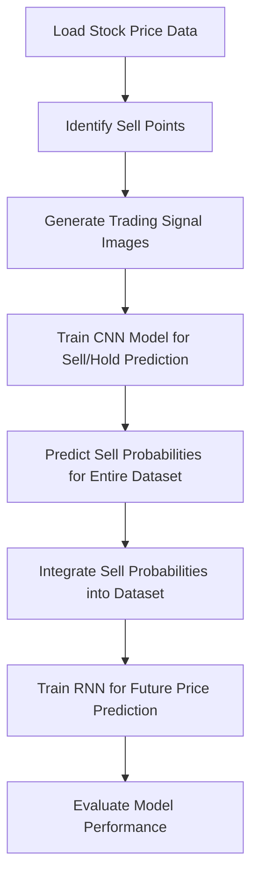
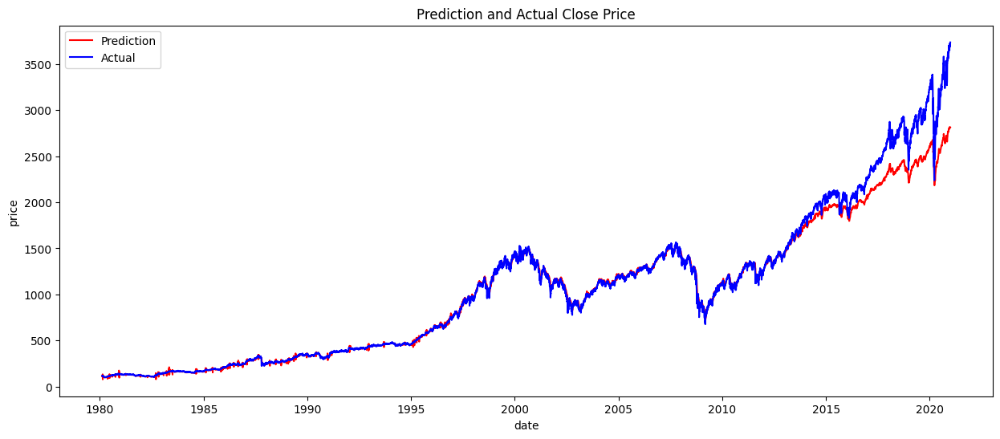
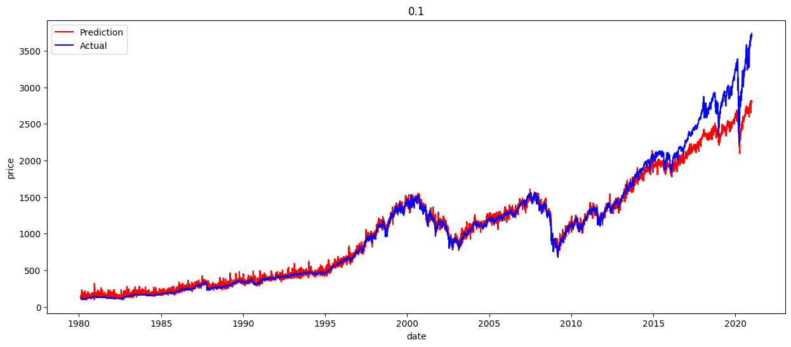
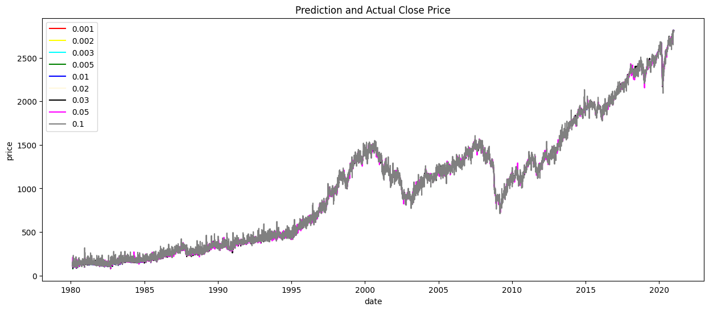

# **S&P500 prediction via CNN+RNN**

## Author ：Hang Ye

## **📌 Project Overview**
This project aims to predict trading signals using a hybrid **CNN-RNN** model. The workflow includes:
- **Data Preprocess**: Convert the sequence price data into price image.
- **CNN**: Identifies trading signals (Sell/Hold) from historical price data transformed into images.
- **RNN**: Predicts future price movements based on past trading signals and prices.

## **🔧 Project Workflow**
1. **Data Preprocessing**
   - Load historical stock prices.
   - Identify **sell points** using a rule-based approach.
   - Generate images for each **sell/hold** decision.

2. **CNN Model**
   - Train a **CNN model** to classify images into **sell** or **hold**.
   - Use trained CNN to compute **sell probabilities** for the entire dataset.

3. **Sell Probability Integration**
   - Merge **sell probabilities** into the dataset.
   - Normalize the dataset for use in the RNN.

4. **RNN Model**
   - Use **historical prices & sell probabilities** to train an **RNN model**.
   - Predict future prices based on past data.

5. **Evaluation & Testing**
   - Compare predicted prices against actual prices.
   - Assess the model's performance.

---

## **📊 Project Architecture**


---

## **📂 Project Structure**
```
📁 project_root/
│── 📄 main.ipynb                              # main file 
│── 📁 train_hold_point_image/                 # Trading signal images
│── 📁 train_sell_point_image/                 # Trading signal images
│── 📄 data                                    # raw data file
│── 📄 test_data                               # test data file
│── 📄 train_data                              # train data file
```

---

## **📈 Results & Observations**
- **Prediction vs Actual**



- **Prediction vs Actual with Noise 0.001 std**



- **Prediction vs Actual with different Noise Level**



---
For any questions or contributions, feel free to reach out!

